# 🍔 Sistema de Hamburgueria com Padrões de Projeto

Projeto desenvolvido em Java com o objetivo de demonstrar a aplicação prática de 19 padrões de projeto (Design Patterns) em um sistema de hamburgueria.

O sistema foi evoluindo ao longo das aulas, recebendo novos padrões conforme eram apresentados, resultando em uma aplicação modular, organizada e de fácil manutenção.

---

# 📚 Padrões de Projeto Utilizados

## ✅ Singleton
Responsável por garantir uma única instância da configuração do sistema.

📍 Diagrama:
```text
src/main/singleton/diagrama/diagrama-classe.png
```

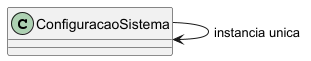

---

## ✅ Factory Method + Decorator
O Factory Method é responsável pela criação dos hambúrgueres e o Decorator adiciona ingredientes extras dinamicamente.

📍 Diagramas:
```text
src/main/factorymethod/diagrama/diagrama-classe+decorator.png
src/main/decorator/diagrama/diagrama-classe+factory_method.png
```

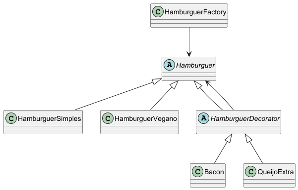

---

## ✅ Abstract Factory
Responsável pela criação de combos completos da hamburgueria.

📍 Diagrama:
```text
src/main/abstractfactory/diagrama/diagrama-classe.png
```

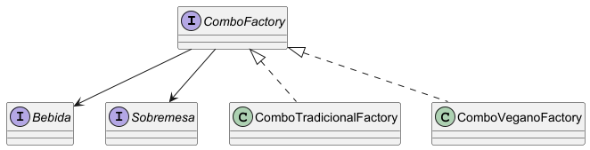

---

## ✅ Bridge
Separa a abstração do pagamento de sua implementação.

📍 Diagrama:
```text
src/main/bridge/diagrama/diagrama-classe.png
```

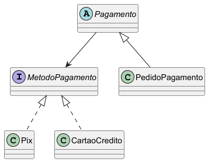

---

## ✅ Observer
Permite notificar clientes sobre alterações no status dos pedidos.

📍 Diagrama:
```text
src/main/observer/diagrama/diagrama-classe.png
```

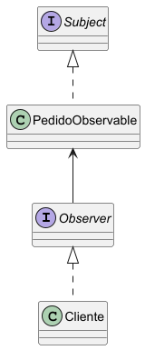

---

## ✅ Strategy
Responsável pelas estratégias de desconto aplicadas aos pedidos.

📍 Diagrama:
```text
src/main/strategy/diagrama/diagrama-classe.png
```

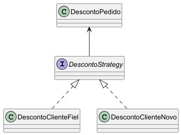

---

## ✅ Chain of Responsibility
Realiza o encaminhamento de solicitações entre níveis de atendimento.

📍 Diagrama:
```text
src/main/chain/diagrama/diagrama-classe.png
```

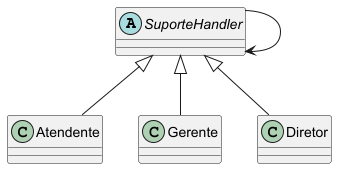

---

## ✅ Mediator
Centraliza a comunicação entre cliente e cozinha.

📍 Diagrama:
```text
src/main/mediator/diagrama/diagrama-classe.png
```

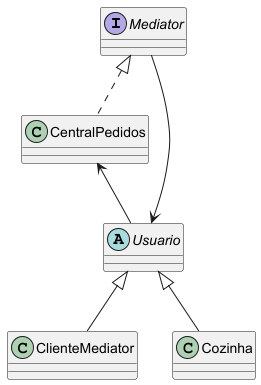

---

## ✅ Template Method
Define um fluxo padrão para processamento de pedidos.

📍 Diagrama:
```text
src/main/templatemethod/diagrama/diagrama-classe.png
```

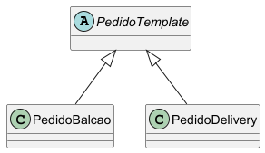

---

## ✅ Builder
Responsável pela construção de pedidos personalizados.

📍 Diagrama:
```text
src/main/builder/diagrama/diagrama-classe.png
```

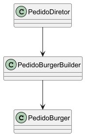

---

## ✅ Facade
Centraliza e simplifica o acesso aos serviços internos da hamburgueria.

📍 Diagrama:
```text
src/main/facade/diagrama/diagrama-classe.png
```

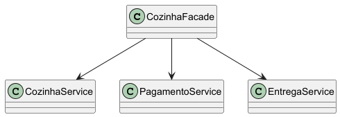

---

## ✅ Composite
Permite representar produtos individuais e combos compostos.

📍 Diagrama:
```text
src/main/composite/diagrama/diagrama-classe.png
```

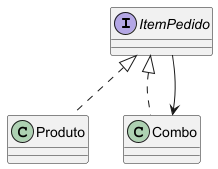

---

## ✅ State
Controla os estados do pedido durante seu fluxo.

### 📌 Diagrama de Classes

📍 Local:
```text
src/main/state/diagrama/classe/diagrama-classe.png
```

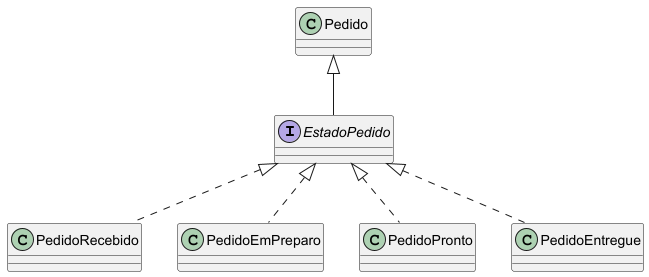

### 📌 Diagrama de Estados

📍 Local:
```text
src/main/state/diagrama/estado/diagrama-estago.png
```


---

## ✅ Memento
Responsável por salvar e restaurar estados anteriores dos pedidos.

📍 Diagrama:
```text
src/main/memento/diagrama/diagrama-classe.png
```


---

## ✅ Visitor
Permite adicionar operações aos itens do pedido sem modificar suas classes.

📍 Diagrama:
```text
src/main/visitor/diagrama/diagrama-classe.png
```


---

## ✅ Flyweight
Permite compartilhar objetos de ingredientes entre múltiplos pedidos, reduzindo o consumo de memória.

📍 Diagrama:
```text
src/main/flyweight/diagrama/diagrama-classe.png
```

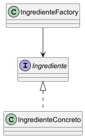

---

## ✅ Iterator
Permite percorrer coleções de pedidos sem expor sua estrutura interna.

📍 Diagrama:
```text
src/main/iterator/diagrama/diagrama-classe.png
```

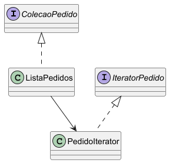

---

## ✅ Prototype
Permite criar novos pedidos a partir da clonagem de pedidos existentes.

📍 Diagrama:
```text
src/main/prototype/diagrama/diagrama-classe.png
```

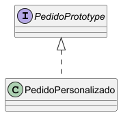

---

# 🚀 Como Executar

## ▶️ Executar aplicação

Execute a classe:

```text
src/main/app/Main.java
```

---

## 🧪 Executar testes

```bash
mvn clean test
```

---

# 📁 Estrutura do Projeto

```text
src/
├── main/
│   ├── singleton/
│   ├── factorymethod/
│   ├── decorator/
│   ├── abstractfactory/
│   ├── bridge/
│   ├── observer/
│   ├── strategy/
│   ├── chain/
│   ├── mediator/
│   ├── templatemethod/
│   ├── builder/
│   ├── facade/
│   ├── composite/
│   ├── state/
│   ├── memento/
│   ├── visitor/
│   ├── flyweight/
│   ├── iterator/
│   ├── prototype/
│   └── app/
│
└── test/
```

---

# 🧪 Testes

O projeto possui testes automatizados utilizando JUnit 5 para todos os padrões implementados.

---

# 🛠️ Tecnologias Utilizadas

- Java 17
- Maven
- JUnit 5
- PlantUML
- IntelliJ IDEA
