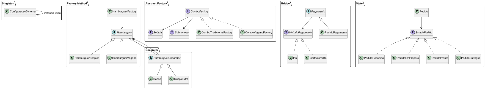

# 🍔 Sistema de Hamburgueria com Padrões de Projeto

O sistema foi estruturado para demonstrar, de forma prática e organizada, como diferentes padrões de projeto podem ser aplicados em conjunto para resolver problemas comuns de desenvolvimento.

Foram utilizados os seguintes padrões de projeto:

* Singleton
* Factory Method
* Abstract Factory
* Bridge
* Decorator
* State

## 📊 Diagrama de Classes



## 🚀 Como Executar

### ▶️ Rodar a aplicação

Execute a classe `Main` localizada em:

```
src/main/app/Main.java
```

### 🧪 Rodar os testes

```bash
mvn test
```

## 🏗️ Estrutura do Projeto

```
src/
├── main/ → código da aplicação
└── test/ → testes automatizados (JUnit)
```

## 📌 Tecnologias Utilizadas

* Java 17
* Maven
* JUnit 5
