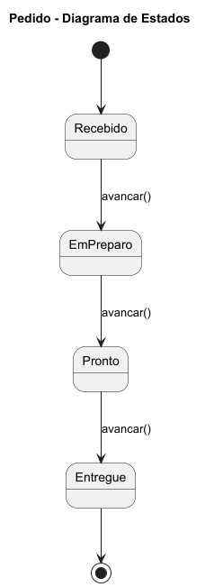

# 🍔 Sistema de Hamburgueria com Padrões de Projeto

O sistema foi desenvolvido para demonstrar, de forma prática e organizada, a aplicação de múltiplos padrões de projeto em um único domínio de negócio: uma hamburgueria.

A proposta do projeto é simular funcionalidades reais como montagem de pedidos, formas de pagamento, descontos, acompanhamento de status, notificações e atendimento ao cliente, utilizando boas práticas de orientação a objetos.

## 🎯 Padrões de Projeto Utilizados

Foram implementados os seguintes padrões:

* Singleton
* Factory Method
* Abstract Factory
* Bridge
* Decorator
* State
* Observer
* Strategy
* Chain of Responsibility

## 📊 Diagrama de Classes


## 🔄 Diagrama de Estados



## 🚀 Como Executar

### ▶️ Rodar a aplicação

Execute a classe `Main` localizada em:

```
src/main/app/Main.java
```

### 🧪 Rodar os testes

```bash
mvn test
```

## 🏗️ Estrutura do Projeto

```
src/
├── main/ → código da aplicação
└── test/ → testes automatizados (JUnit)
```

## 📌 Tecnologias Utilizadas

* Java 17
* Maven
* JUnit 5
