# 🍔 Sistema de Hamburgueria com Padrões de Projeto

Projeto desenvolvido em Java com o objetivo de demonstrar a aplicação prática de 23 padrões de projeto (Design Patterns) em um sistema de hamburgueria.

O sistema foi evoluindo ao longo das aulas, recebendo novos padrões conforme eram apresentados, resultando em uma aplicação modular, organizada e de fácil manutenção.

---

# 🗂️ Diagrama Completo do Sistema

Visão geral contendo todas as classes e relacionamentos dos padrões de projeto implementados na hamburgueria.

📍 Diagrama:

```text
diagrama-completo/diagrama_classes_hamburgueria.png
```

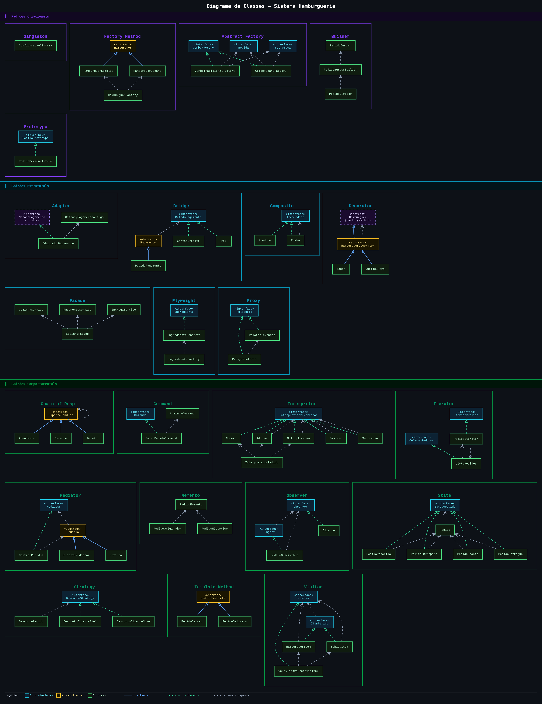

---

# 📚 Padrões de Projeto Utilizados

## ✅ Singleton

Responsável por garantir uma única instância da configuração do sistema.

📍 Diagrama:

```text
src/main/singleton/diagrama/Singleton.png
```

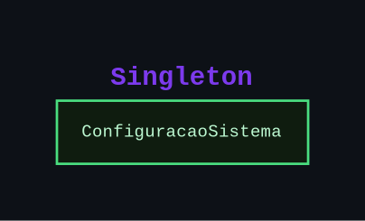

---

## ✅ Factory Method

O Factory Method é responsável pela criação dos hambúrgueres.

📍 Diagramas:

```text
src/main/factorymethod/diagrama/Factory_Method.png
```

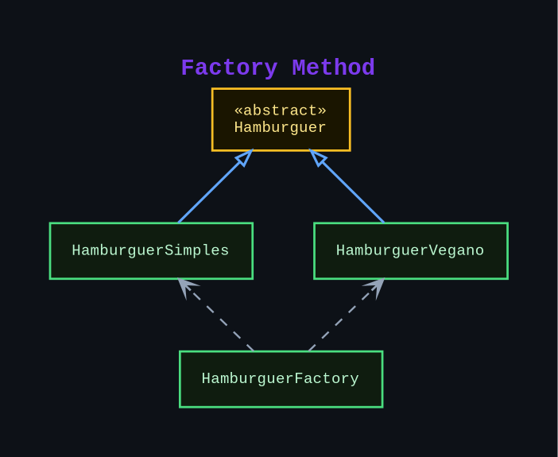

---

## ✅ Decorator

O Decorator é responsavel por adicionar ingredientes extras dinamicamente.

📍 Diagramas:

```text
src/main/decorator/diagrama/Decorator.png
```

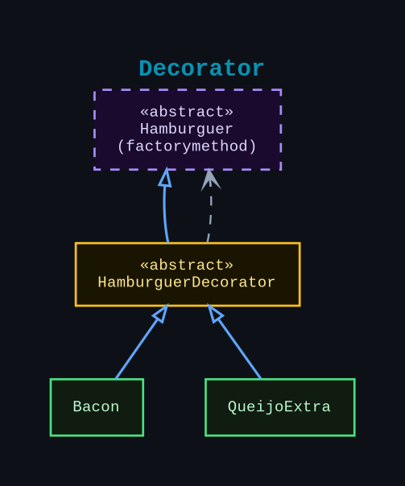

---

## ✅ Abstract Factory

Responsável pela criação de combos completos da hamburgueria.

📍 Diagrama:

```text
src/main/abstractfactory/diagrama/Abstract_Factory.png
```

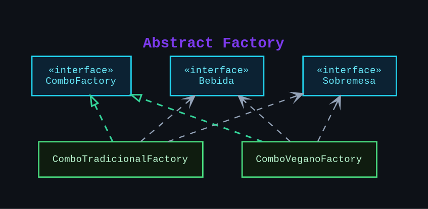

---

## ✅ Bridge

Separa a abstração do pagamento de sua implementação.

📍 Diagrama:

```text
src/main/bridge/diagrama/Bridge.png
```

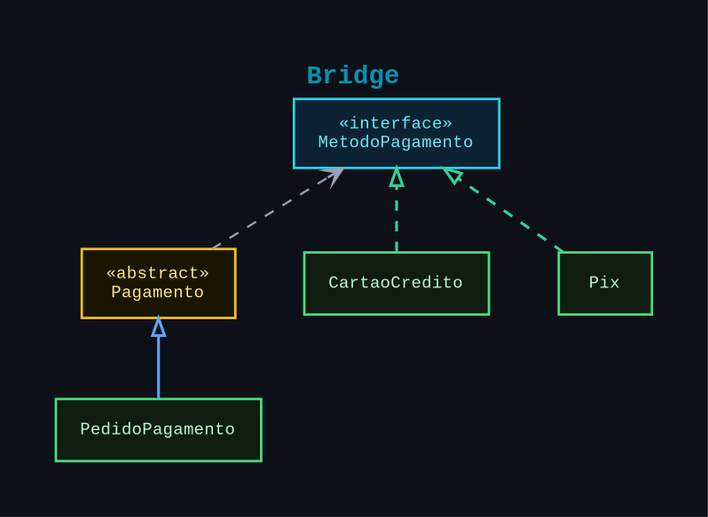

---

## ✅ Observer

Permite notificar clientes sobre alterações no status dos pedidos.

📍 Diagrama:

```text
src/main/observer/diagrama/Observer.png
```

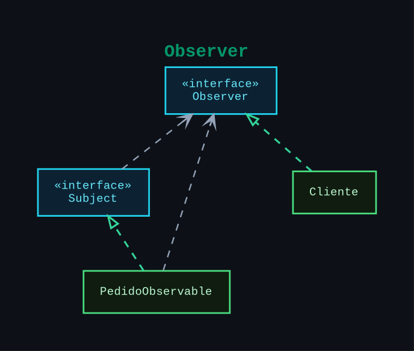

---

## ✅ Strategy

Responsável pelas estratégias de desconto aplicadas aos pedidos.

📍 Diagrama:

```text
src/main/strategy/diagrama/Strategy.png
```

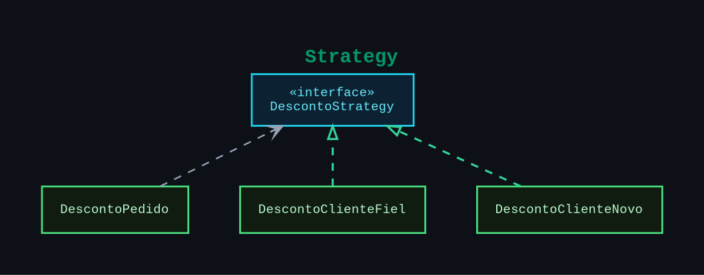

---

## ✅ Chain of Responsibility

Realiza o encaminhamento de solicitações entre níveis de atendimento.

📍 Diagrama:

```text
src/main/chain/diagrama/Chain_of_Resp.png
```

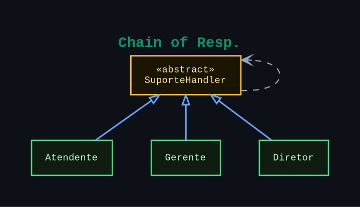

---

## ✅ Mediator

Centraliza a comunicação entre cliente e cozinha.

📍 Diagrama:

```text
src/main/mediator/diagrama/Mediator.png
```

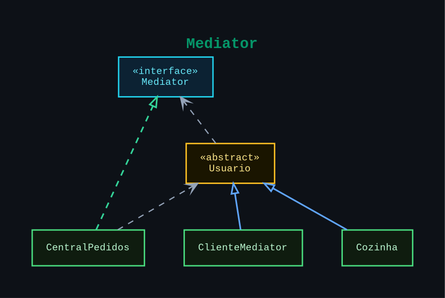

---

## ✅ Template Method

Define um fluxo padrão para processamento de pedidos.

📍 Diagrama:

```text
src/main/templatemethod/diagrama/Template_Method.png
```

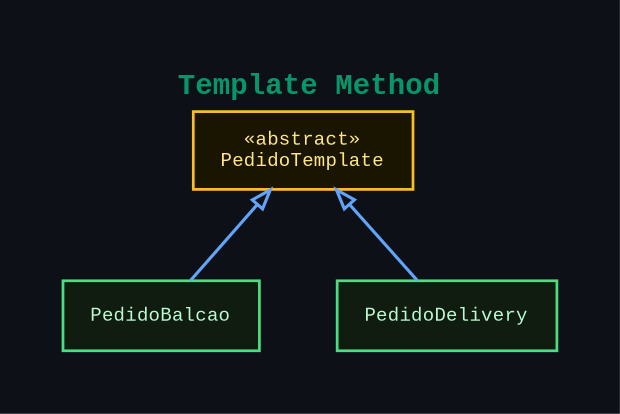

---

## ✅ Builder

Responsável pela construção de pedidos personalizados.

📍 Diagrama:

```text
src/main/builder/diagrama/Builder.png
```

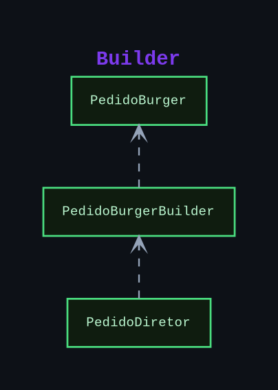

---

## ✅ Facade

Centraliza e simplifica o acesso aos serviços internos da hamburgueria.

📍 Diagrama:

```text
src/main/facade/diagrama/Facade.png
```

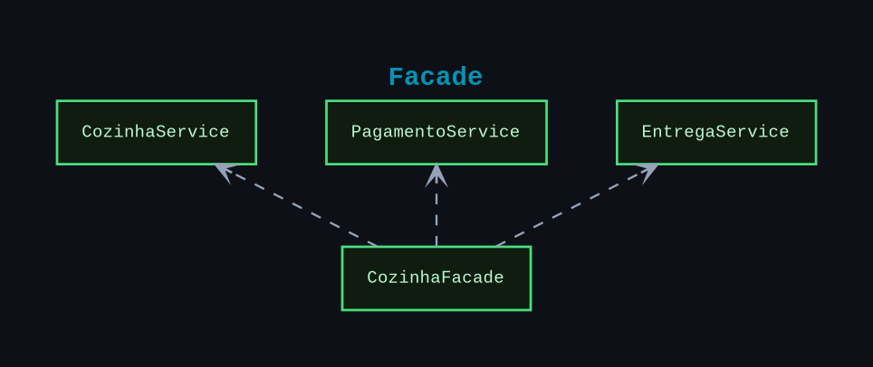

---

## ✅ Composite

Permite representar produtos individuais e combos compostos.

📍 Diagrama:

```text
src/main/composite/diagrama/Composite.png
```

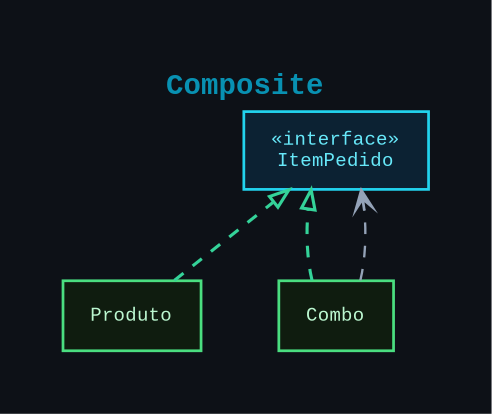

---

## ✅ State

Controla os estados do pedido durante seu fluxo.

### 📌 Diagrama de Classes

📍 Local:

```text
src/main/state/diagrama/classe/State.png
```

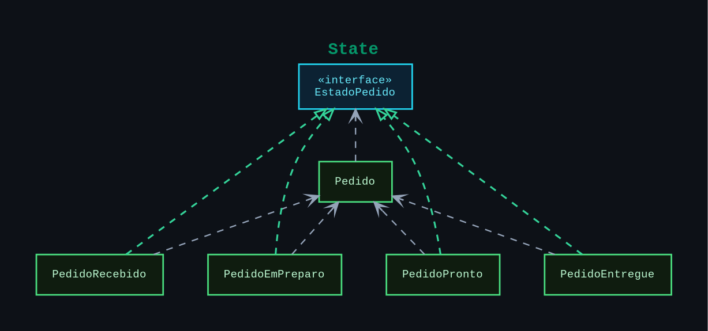

### 📌 Diagrama de Estados

📍 Local:

```text
src/main/state/diagrama/estado/diagrama_estado.png
```

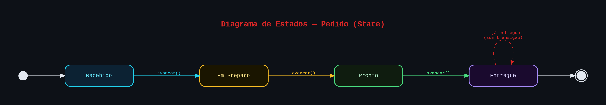

---

## ✅ Memento

Responsável por salvar e restaurar estados anteriores dos pedidos.

📍 Diagrama:

```text
src/main/memento/diagrama/Memento.png
```

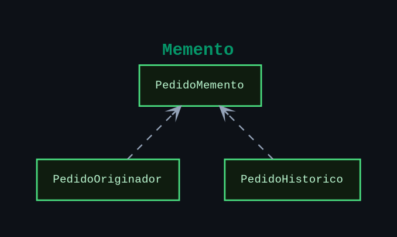

---

## ✅ Visitor

Permite adicionar operações aos itens do pedido sem modificar suas classes.

📍 Diagrama:

```text
src/main/visitor/diagrama/Visitor.png
```

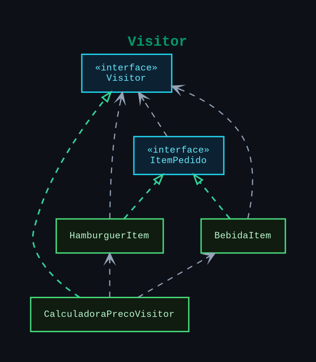

---

## ✅ Flyweight

Permite compartilhar objetos de ingredientes entre múltiplos pedidos, reduzindo o consumo de memória.

📍 Diagrama:

```text
src/main/flyweight/diagrama/Flyweight.png
```

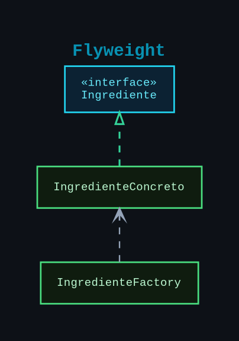

---

## ✅ Iterator

Permite percorrer coleções de pedidos sem expor sua estrutura interna.

📍 Diagrama:

```text
src/main/iterator/diagrama/Iterator.png
```

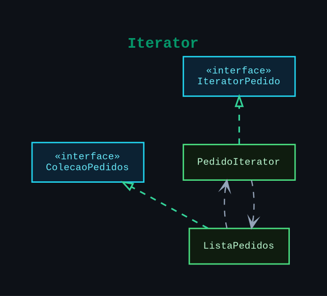

---

## ✅ Prototype

Permite criar novos pedidos a partir da clonagem de pedidos existentes.

📍 Diagrama:

```text
src/main/prototype/diagrama/Prototype.png
```

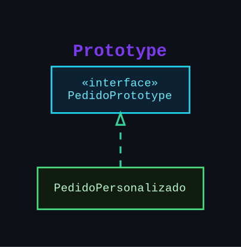

---

## ✅ Adapter

Permite integrar sistemas externos ou legados ao sistema de pagamentos da hamburgueria.

📍 Diagrama:

```text
src/main/adapter/diagrama/Adapter.png
```

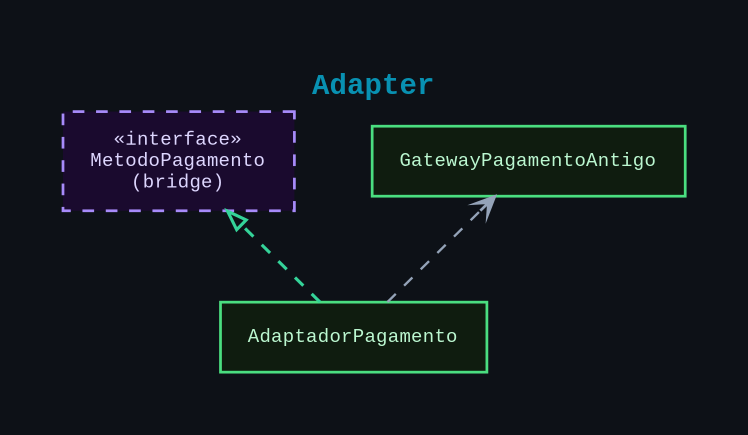

---

## ✅ Command

Encapsula solicitações como objetos, permitindo executar operações de pedidos de forma desacoplada.

📍 Diagrama:

```text
src/main/command/diagrama/Command.png
```

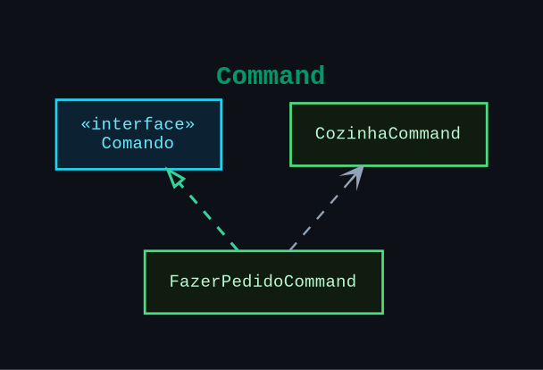

---

## ✅ Proxy

Controla o acesso a recursos do sistema, adicionando uma camada intermediária para gerenciamento e otimização.

📍 Diagrama:

```text
src/main/proxy/diagrama/Proxy.png
```

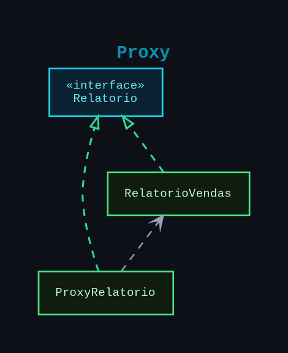

---

## ✅ Interpreter

Permite interpretar expressões e cálculos relacionados aos pedidos da hamburgueria utilizando uma estrutura baseada em gramática e árvore de expressões.

📍 Diagrama:

```text
src/main/interpreter/diagrama/Interpreter.png
```

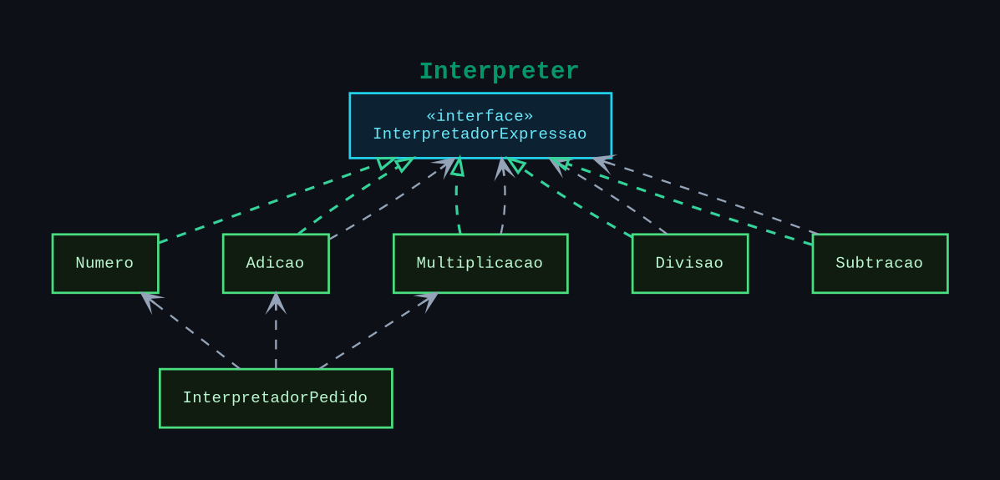

---

# 🚀 Como Executar

## ▶️ Executar aplicação

Execute a classe:

```text
src/main/app/Main.java
```

---

## 🧪 Executar testes

```bash
mvn clean test
```

---

# 📁 Estrutura do Projeto

```text
src/
├── main/
│   ├── singleton/
│   ├── factorymethod/
│   ├── decorator/
│   ├── abstractfactory/
│   ├── bridge/
│   ├── observer/
│   ├── strategy/
│   ├── chain/
│   ├── mediator/
│   ├── templatemethod/
│   ├── builder/
│   ├── facade/
│   ├── composite/
│   ├── state/
│   ├── memento/
│   ├── visitor/
│   ├── flyweight/
│   ├── iterator/
│   ├── prototype/
│   ├── adapter/
│   ├── command/
│   ├── proxy/
│   ├── interpreter/
│   └── app/
│
└── test/
```

---

# 🧪 Testes

O projeto possui testes automatizados utilizando JUnit 5 para todos os padrões implementados.

---

# 🛠️ Tecnologias Utilizadas

* Java 17
* Maven
* JUnit 5
* PlantUML
* IntelliJ IDEA
